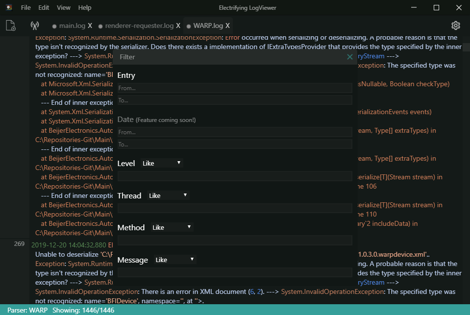

# Filter

The filter dialog can be opened when there is an open logfile by pressing ``space``. Number of filterable log properties such as Level, Thread & Method is detemermined by which parser is used for that particular file.

