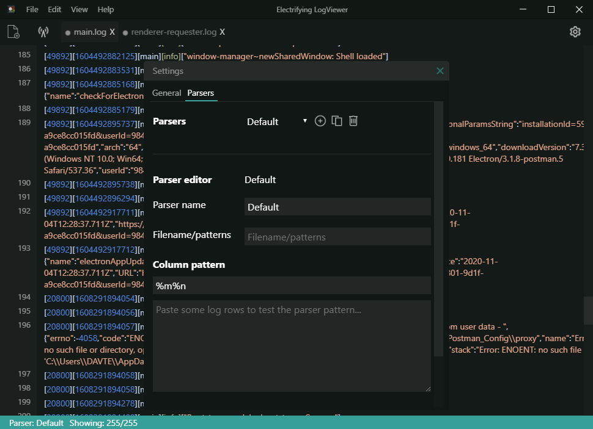

# Parsers

Parsers are used to control which log entries are found in a logfile by matching it's format. 

## Default parser 

The *Default parser* comes pre-installed with the application will parse each line in log file as one entry, this is not optimal for filtering scenarios, as each line of a log file is treated as its own entry.

## Custom parsers

A custom parser can be created for any logfile to match its format. The dialog is located under settings.

Create a parser:

1. **Name**: Name of the parser.
2. **Filename/Patterns**: Decide which file name patterns it should match e.g. **.log*, **yourname.log*. Use a ``,`` (comma) to separate the patterns.
3. **Column pattern**: This pattern should match your logfile's fomat by using the application's column specifier syntax. (Regex not currently supported).

Pre defined specifiers: 
   - Date: ``%d``
   - Level: ``%p``
   - Thread: ``%t``
   - Logger: ``%c``
   - Message: ``%m``
   - End of line: ``%n``
   - Match word: ``%s`` 
   - Match sentence: ``%S``

## Samples 

Log4Net

````
Log4Net config conversion patttern
%date [%thread] %level %logger - %message%newline

Generates
2021-02-07 16:03:39,068 [1] INFO Application.AClassName - important message.

Converts to syntax column specifier syntax:
%d [%t] %p %c - %m%n
````

Customize property/column names by adding ``{YourColumnName}`` e.g ``%s{YourColumnName}``.

````
[2021-02-04 19:43:43.230] [error] - someProperty - another custom logger property - fatal error message.

Converts to syntax column specifier syntax:
[%d] [%p] - %s{CustomPropertyOne} - %S{CustomPropertyTwo} - %m%n
````

Pattern for the Default parser is ``%m%n``, which means it treats every line as a message.

